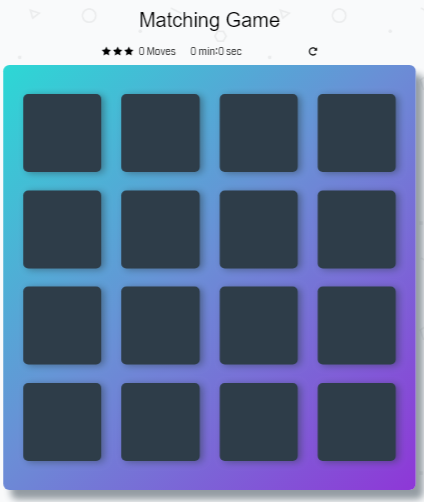

# Memory Game Project
This is a browser-based card matching game (also known as Concentration).

## Installing
You can run and play this game by cloning this project via GitHub to your own device and open the index.html file.

## Challenge
Match all the cards with fewer moves in less time.

## How to Play

### Instructions
* Click on any card
* Keep flipping and revealing cards and work on remembering them.
* Match cards fast with fewer moves

### Score Panel
The score panel of this game consist of three parts:
* Rating: which consists of three stars. The more mismatches the lower the number of stars.
* Timer: once you start the game, a timer will start recording the game time and stops when you finish the game.
* Rest Button: to reset the game

## Dependencies
* #### [Google Fonts] (https://fonts.google.com)
* #### [Font Awesome] (https://fontawesome.com/)
* #### [Sweet Alert] (https://sweetalert.js.org/guides/)
